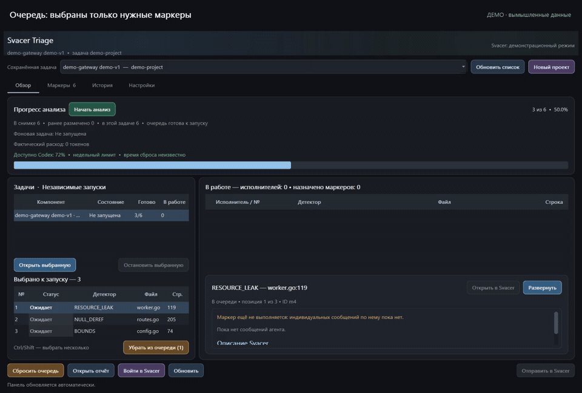
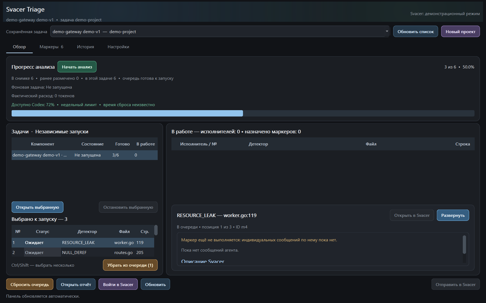
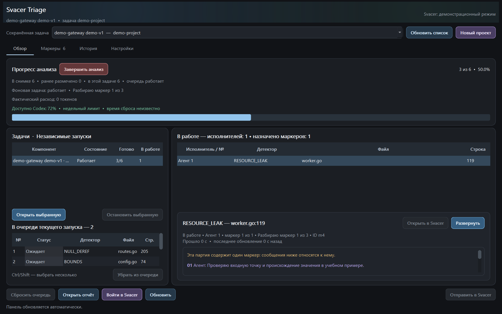
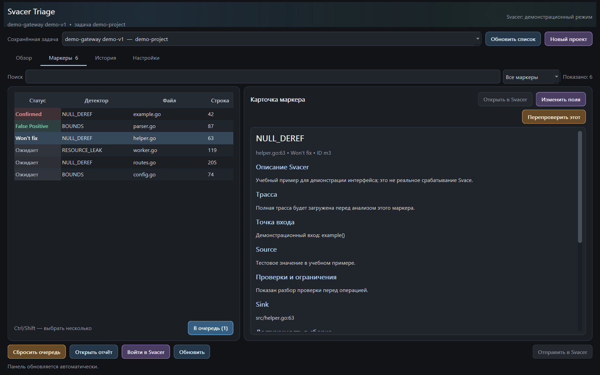
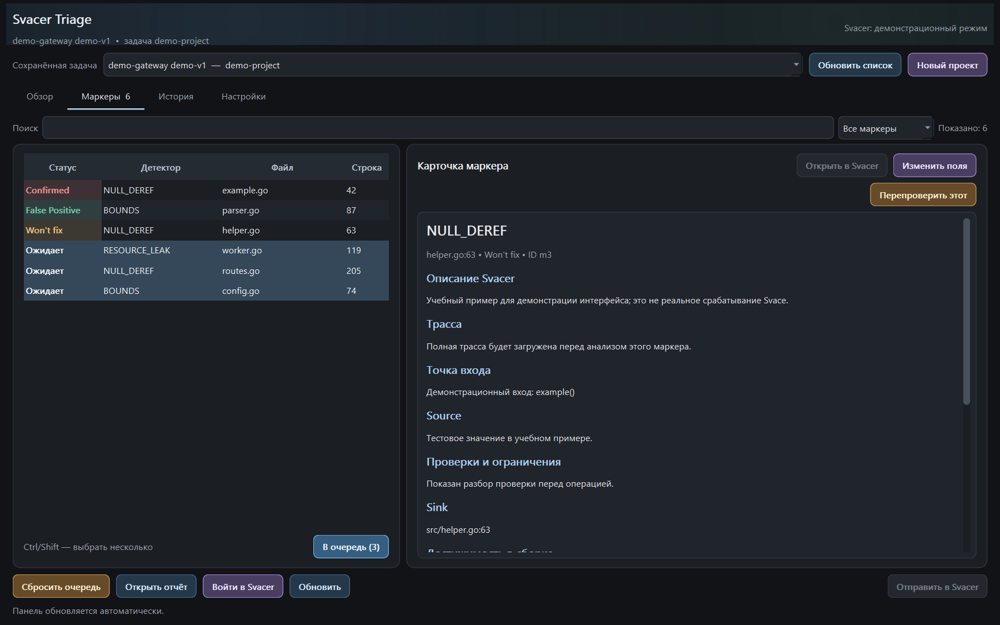
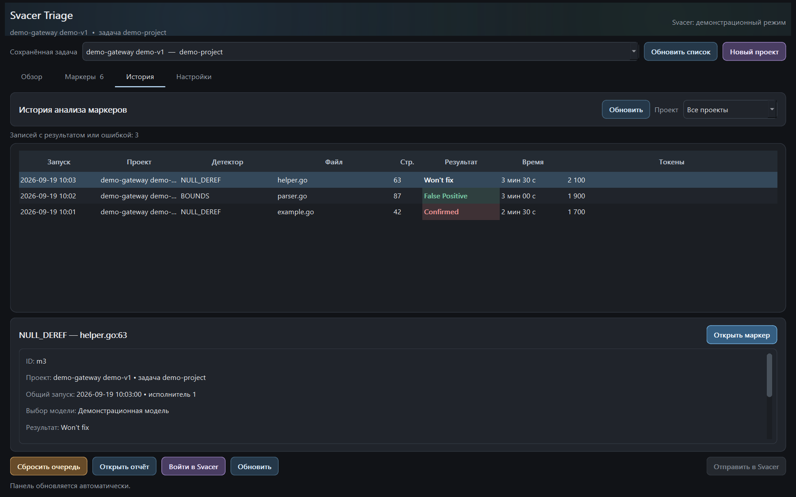
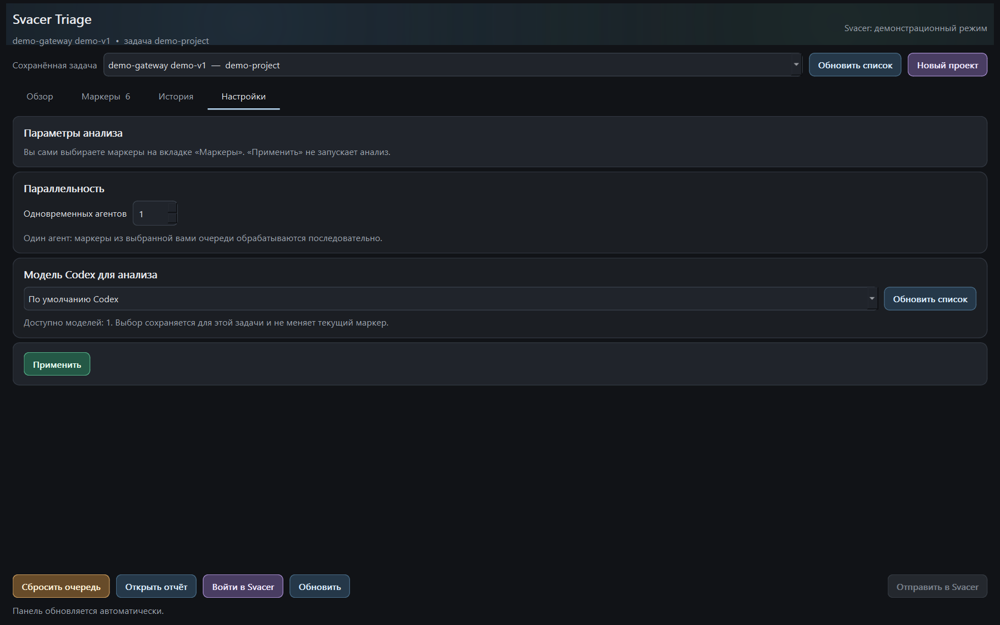
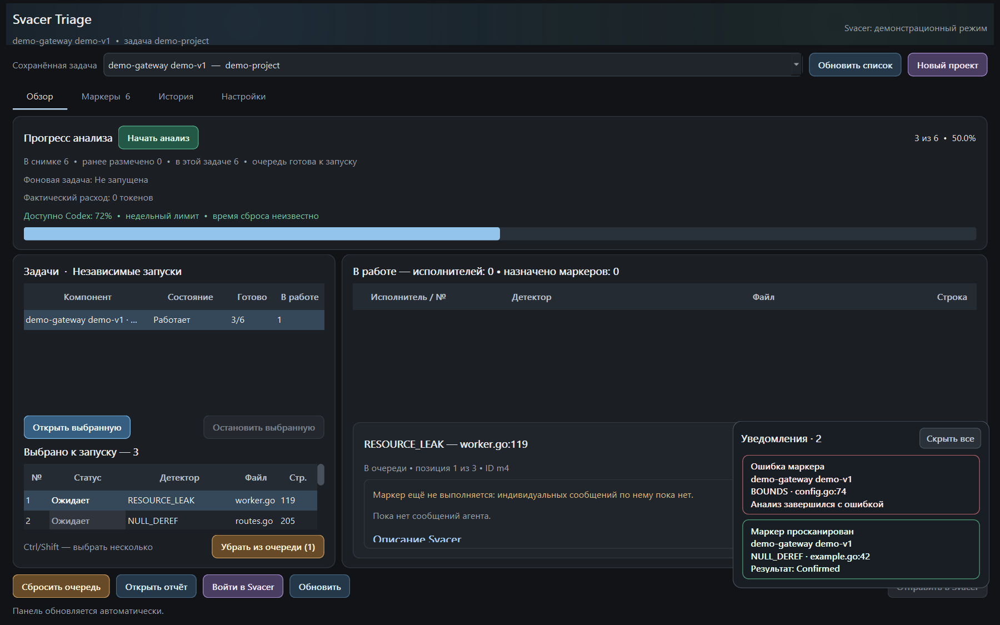

# Svacer Triage

Windows-приложение и контейнерный web-сервис для разбора маркеров Svace/Svacer
по ГОСТ 71207-2024.
Оно загружает выбранный снимок, помогает исследовать трассы и исходники с помощью
Codex, сохраняет доказательства и готовит решения к проверке человеком. **Вердикт
модели не является доказательством сам по себе.** Отправка разметки в Svacer —
отдельный шаг с предварительной проверкой и явным подтверждением.

Приложение рассчитано на рабочие снимки и локальное использование. Не публикуйте
папку задачи: в ней могут находиться исходники, трассы, комментарии и служебные
журналы. Пароли и токены не нужно записывать в README или настройки.

## Краткое руководство

В настройках каждой задачи можно выбрать область разметки: весь продукт вместе со
сборкой и инструментами (по умолчанию) либо только поставляемый продукт. Во втором
режиме проверенные по точной ревизии отдельные build-only зависимости получают
**Won't fix — вне области разметки**, без вызова модели. Это не утверждение, что
дефект доказан или что инструмент безопасен. Неизвестная или смешанная категория
(например, build + runtime/API) не исключается автоматически. Выбор не меняет уже
сохранённые решения и не запускает очередь; область можно менять после остановки анализа.

1. В свежем клоне откройте `START.vbs`: появится окно с анимированным хомяком и
   текущим этапом запуска. Установка пройдёт автоматически, после чего окно явно
   сообщит **«Готово — приложение открыто»**. В дальнейшем используйте созданный
   ярлык **Svacer Triage**.
2. При первом запуске форма входа откроется автоматически. Введите адрес Svacer,
   логин и пароль. В поле сервера можно вставить ссылку на проект или снимок —
   приложение само выделит адрес сервера и запустит подключение после входа.
3. Нажмите **«Новый проект»**, выберите снимок Svacer, Git-репозиторий и точную
   ревизию исходников. После создания маркеры загрузятся автоматически.
4. На вкладке **«Маркеры»** отфильтруйте и выделите нужные строки, затем нажмите
   **«В очередь»**.
5. На вкладке **«Настройки»** выберите модель и число агентов. Каждый агент
   одновременно исследует один маркер; остальные выбранные маркеры ожидают.
6. На вкладке **«Обзор»** нажмите **«Начать анализ»** и следите за состоянием,
   черновиками и уведомлениями.
7. Проверьте доказательства и комментарии. Отправляйте разметку в Svacer только
   после собственной проверки и отдельного подтверждения в приложении.

Для обычной работы терминал и отдельные консольные окна не нужны.

Для заранее выбранных очередей предусмотрен отдельный локальный контроллер
автоматического продолжения с резервом лимита Codex. Он последовательно запускает
задачи, ограничивает повторы технических сбоев и сохраняет результаты при остановке.
Это дополнительный режим, а не включённое по умолчанию ограничение всех запусков.
Порог, ограничения и диагностика описаны в [автоматическом анализе](docs/AUTOMATIC_ANALYSIS.md).

**«Настройки → Останавливать при остатке Codex»** задаёт порог в процентах:
например, `20` останавливает анализ при остатке **20% или меньше**, `0` отключает
эту дополнительную защиту. Это не бюджет токенов на запуск. Порог сохраняется для
проекта между запусками; после **«Применить»** новый процесс проверяет его каждые
15 секунд и перед работой. Старому уже запущенному процессу нужен перезапуск.
Остановка сохраняет результаты и очередь; автоматического возобновления нет.
При неизвестном остатке включённая защита останавливает анализ. Из-за задержки
учёта и другой активности аккаунта точный остаток не гарантируется.
Такое же поле есть в веб-интерфейсе. Более строгий порог автоматической кампании
оно не отменяет.

Приложение запускает отдельный процесс Codex для каждого назначенного маркера.
Исполнители параллельно и независимо получают недостающие исходники; сбой одного
не переводит остальных в последовательный режим. Проверенный результат сразу
появляется в сохранённых решениях и истории, а свободный исполнитель берёт следующий
выбранный маркер, не ожидая остальных. Подготовка и независимая проверка Confirmed
занимают только свой слот. Справа от «Начать анализ» показаны модель, лимит
параллельности и, во время запуска, число занятых слотов. В карточке выбранного маркера
показаны только его сообщения, локальные шаги и время последнего события.
В истории новых запусков время и токены измеряются по индивидуальным журналам;
старые общие журналы не позволяют достоверно разделить расход между маркерами.
Долгое отсутствие сообщений отмечается предупреждением, а не фиктивным обновлением.

Для внешних зависимостей Envoy, включая nghttp2, LuaJIT, libevent и Gazelle,
приложение заранее сохраняет исходники в локальный кэш задачи, если доступен
поддерживаемый зафиксированный рецепт. Имена берутся из путей Bazel `external/`,
а не из закрытого списка библиотек. Версии и SHA-256 берутся из
выбранной ревизии Envoy, его патчи применяются без запуска сборочных скриптов.
Доступные файлы сверяются со снимком Svacer; расхождения блокируют использование
архива как доказательства. Повторные запуски используют кэш без скачивания.
Сначала проверяются локальные файлы и кэш, затем запрашиваются недостающие файлы
снимка. Один повторный или неудачный запрос не блокирует новые запросы того же агента.
Сгенерированные конфигурации и эффективные флаги конкретной сборки не выдумываются:
если их нельзя доказать по сохранённым данным, маркер остаётся на доисследовании.
Каждый ответ сохраняется в отдельный файл текущего сеанса; старый черновик не
считается новым результатом. Требования к вердиктам и доказательствам не ослабляются.
Неизвестный рецепт или неподдерживаемое преобразование отображается как причина
неполной подготовки; приложение не подставляет другую версию. Встроенный просмотрщик
даёт агентам поиск по нужному репозиторию и точные фрагменты с номерами строк,
даже если `rg` не установлен. При перепроверке старый итог не заменяет новое исследование.

Если точных локальных данных недостаточно, агент может искать недостающие публичные
исходники и контракты API в интернете. Live web search включён явно, поиск ограничен
площадками исходников и официальной документацией; проверяются официальный upstream,
нужная версия и патчи. В запросах запрещены внутренние адреса, идентификаторы Svacer,
трассы, комментарии, локальные пути и содержимое рабочих файлов. Фильтр доменов
ограничивает сайты, но сам по себе не является фильтром утечек содержимого запросов.

В карточке агента видны события веб-поиска. Найденные ссылки сохраняются локально
для продолжения того же маркера; исходники для итогового доказательства по-прежнему
получаются и проверяются через точный снимок/кэш. Страница из другой версии или ответ
поисковика не становятся готовым вердиктом и не обходят проверку доказательств.

Фоновые исследования используют выбранную пользователем модель с глубиной `high`.
Агент сразу получает небольшой точный фрагмент вокруг срабатывания; это исходные данные,
а не подсказанный вердикт. Старые незавершённые заметки перепроверяются, а не принимаются
за доказательство. При наличии исходников предусмотрена одна дополнительная проверка
причин остановки: она отличает недостающие данные от ещё не исследованного локального
пути. Число попыток ограничено; если доказательств действительно нет, результат остаётся
незавершённым. Этот проход и повышенная глубина могут увеличить время и расход токенов.
Просмотрщик ищет по имени файла и во вложенных каталогах; длинные чтения возвращаются
страницами с `next_line`, а пустая область поиска не считается полным поиском.
Если агенту запрещена запись файла, полный JSON можно вернуть ответом: его сохраняет
само приложение, затем выполняются те же проверки ID, ревизии и доказательств.
Автоматическая проверка разрешений Codex сохраняется; несовместимый с ней режим
`--ephemeral` не используется. Журнал сеанса также сохраняется локально самим Codex.

Инструкции, ход исследования, сообщения прогресса и аналитические пояснения агента
ведутся на русском. Не переводятся имена JSON-полей, значения вердиктов, символы,
пути и дословные цитаты исходников. Готовое поле `comment` также пишется по-русски
для вставки в Svacer. Экономия токенов обеспечивается ограниченным контекстом:
каждый агент получает только свой маркер и относящиеся к нему трассы/исходники.

## Видеодемонстрация

20 секунд: выбор маркеров, очередь, карточка, анализ, история и настройки.
Нажмите на анимированное превью, чтобы открыть полное видео.

[](docs/demo.mp4)

[Открыть полное видео MP4 — 20 секунд, без звука](docs/demo.mp4).
Видео записано только на **вымышленных данных**, без подключения к Svacer и Codex.

## Интерфейс

Скриншоты ниже сделаны на **вымышленном проекте и демонстрационных маркерах**.
Они показывают устройство интерфейса, а не результаты реального анализа.

**Обзор:** независимые задачи, выбранная очередь и текущий маркер.



**Анализ в работе:** один назначенный маркер у агента, остальные выбранные —
в очереди; сообщения агента видны в карточке справа.



**Маркеры:** цветные статусы и карточка с обоснованием.



**Выбор нескольких маркеров:** Ctrl/Shift позволяет подготовить выбранные
срабатывания к добавлению в очередь.



**История:** завершённые попытки, результаты, время и расход токенов.



**Настройки:** число агентов и модель для следующих назначений.



**Уведомления:** результат и ошибка остаются на экране до открытия или скрытия.



В окне четыре вкладки:

- **Обзор** — состояния независимых задач, один назначенный маркер на агента,
  остальные выбранные маркеры в очереди, живые сообщения и управление запуском.
  Ожидающие маркеры можно выделить через Ctrl/Shift и убрать из очереди, не
  затрагивая работу агента, сохранённые решения и черновики.
- **Маркеры** — поиск, фильтр по статусу, выбор нескольких строк через Ctrl/Shift,
  карточка с трассой, доказательствами и комментарием. Готовое решение можно
  добавить на перепроверку; оно не будет запущено сразу при добавлении.
- **История** — завершённые попытки с результатом либо ошибкой, время, доступные
  данные о токенах и сохранённые сообщения. Пустые попытки не показываются.
- **Настройки** — число одновременных агентов и модель Codex для *следующих*
  назначений. Применение настроек не запускает и не прерывает анализ.

Статусы, действия и уведомления выделяются цветом. Уведомления остаются на экране
до открытия или нажатия «Скрыть все». Верхняя часть окна слегка анимирована;
движение можно отключить переменной `SVACER_REDUCE_MOTION=1`.

## Подробный порядок работы

Нужны Windows, Python 3.10+, Git, установленный Codex Desktop, доступ к нужному
снимку Svacer и, при первой установке, доступ к источникам открытых зависимостей.
Для графического интерфейса используется PySide6.

1. При первом входе укажите адрес **своего** Svacer прямо в форме. Приложение
   сохранит публичный адрес сервера и безопасные настройки рабочего процесса в
   локальном `app\svacer-settings.json`; пароль и токены туда не записываются.
   Отсутствующие настройки старой установки восстанавливаются автоматически,
   а явно заданные пользователем значения не заменяются.
2. Встроенный MCP-коннектор находится в `app\triage_connector` и поставляется
   вместе с приложением.
3. Откройте `START.vbs` или `START.cmd` двойным щелчком. На чистом компьютере
   установка и восстановление запускаются автоматически, без меню и консоли.
   В отдельном небольшом окне показываются анимированный хомяк, текущий этап и
   подтверждение успешного открытия. Подробный ход установки записывается в
   `logs\startup.log`; после неё приложение откроется само. Фоновые Python,
   Codex и MCP-процессы не создают окон и значков на панели
   задач. Установка создаёт `START.lnk` рядом с программой и ярлык **Svacer Triage**
   в меню «Пуск». Оба ярлыка используют тот же оконный сценарий и общую иконку.
4. При первом открытии форма **«Вход в Svacer»** появится автоматически в том же тёмном
   стиле, без PowerShell и отдельной консоли сервера. Укажите адрес сервера,
   логин и пароль самостоятельно. Вход выполняется в фоне; ошибки показаны в форме, есть отмена.
   Пароль не записывается на диск и не передаётся в аргументах запуска.
   Коннектор хранит данные сессии только в памяти для переподключения к Svacer.
   Закрытие интерфейса не отключает коннектор; для выхода используйте
   **«Выйти из Svacer»**. При первом подключении MCP может потребоваться
   перезапустить Codex Desktop.
5. Нажмите **«Новый проект»** — откроется графическая форма без консоли.
   Мастер занимает большую часть доступного экрана; нижние действия закреплены,
   а содержимое формы прокручивается на небольших экранах и при крупном масштабе Windows.
   Вставьте ссылку на точный снимок Svacer и URL исходного Git-репозитория.
   Если ссылка на репозиторий неизвестна, введите название или ключевые слова,
   например `luajit`, и нажмите **«Найти на GitHub»**. Выберите репозиторий
   в компактном прокручиваемом списке — его HTTPS-ссылка подставится в форму.
   Это поиск только среди публичных репозиториев: GitHub получает поисковую
   фразу, но не данные Svacer, маркеры или исходники.
   Если у вас только ссылка на проект или ветку Svacer, нажмите
   **«Выбрать снимок»** и выберите ветку и снимок прямо в форме. Ветка Svacer
   и Git-ветка — разные сущности; последний снимок не выбирается автоматически.
   Нажмите **«Теги и ветки»**. Найдите версию через поиск и выберите тег
   или ветку в компактном списке внутри формы — он фильтруется при вводе
   и прокручивается, не раскрываясь на весь экран. Также можно вручную указать полный commit SHA.
   Теги и ветки читаются напрямую через Git (GitHub, GitLab и другие серверы).
   Если тегов нет (например, у LuaJIT), откроется список Git-веток.
   Для ветки сохраняется последний commit **на момент загрузки списка**, а не
   изменяемое имя версии. Если ветка продвинется, анализ использует сохранённый
   SHA; при его недоступности остановится, а не подставит новую версию.
   Режим **«Точный commit SHA»** не требует загрузки тегов: вставьте полный SHA
   (40 или 64 символа). Доступность commit проверяется до запуска модели.
   Подтвердите соответствие ревизии снимку: например, `2.11.2` в Svacer
   может соответствовать Git-тегу `v2.11.2`. Это не определяется автоматически.
   Не подставляйте `main` вместо ревизии снимка.
   Причина неактивной кнопки создания показана под формой: например, неполная
   ссылка Svacer, короткий SHA или неподтверждённое соответствие ревизии.
6. После создания проекта маркеры **загружаются автоматически в фоне**,
   затем открывается вкладка «Маркеры». Приложение проверит, что сервер применил
   точный фильтр `ГОСТ 71207-2024` и вернул полный инвентарь. Анализ автоматически
   не запускается. Если загрузка не удалась, проект сохраняется: восстановите
   подключение и нажмите **«Получить маркеры»**. Для повторной загрузки уже
   полученного списка используйте **«Обновить маркеры»**.
7. На вкладке **«Маркеры»** выберите нужные строки и нажмите **«В очередь»**.
   Только выбранные маркеры попадут в запуск: неразмеченные «про запас» не
   подставляются автоматически.
   Загружаются все маркеры текущего ГОСТ-фильтра, включая уже размеченные.
   Фильтры «Размечены в Svacer», «Не размечены в Svacer» и фильтры по вердиктам
   помогают выбрать находки для перепроверки. Статус с пометкой «Svacer» —
   исходная разметка при загрузке, а не новый локальный вывод. Добавление в очередь
   и локальная перепроверка не меняют разметку на сервере.
   Отдельный столбец «Очередь» показывает «В очереди», «В работе» или «Не в очереди»,
   независимо от вердикта. При наведении на отметку видна позиция в очереди;
   та же информация есть в карточке маркера.
8. На вкладке **«Обзор»** нажмите **«Начать анализ»**. Один агент выполняет
   один маркер за раз; при двух агентах одновременно назначаются два, а каждый
   освободившийся агент сразу берёт следующий из выбранной очереди. Число выбранных маркеров не
   сокращает глубину анализа каждого из них.
   Если доказательств не хватает, маркер остаётся в очереди с пометкой
   **«Доисследовать»**, а остальные выбранные маркеры продолжают обрабатываться.
   Готовый результат одного агента сохраняется независимо от незавершённого
   результата другого. После остановки нажмите **«Начать анализ»**, чтобы
   продолжить исследование; уже загруженные точные исходники сохраняются.
   За запуск допускается до восьми раундов получения дополнительных файлов.
   Недостаток исходников не превращается в готовый вердикт и не отправляется
   в Svacer автоматически.
9. Проверьте карточки и готовый отчёт. **«Отправить готовые (N)»** отправляет
   проверенные результаты, не дожидаясь всей задачи; остальные маркеры могут
   продолжать анализироваться. Программа покажет состав партии, пропуски и
   конфликты и запросит отдельное дословное подтверждение перед записью.
   После подтверждённой отправки можно отправлять следующие готовые результаты:
   неизменённые уже отправленные комментарии повторно не отправляются.
   Незавершённые решения, ошибки формата и Confirmed без независимой проверки
   не включаются. При неизвестном результате отправки повтор заблокирован до
   проверки в Svacer — не удаляйте журнал попытки вручную.

Основной вариант для совместной работы — web-сервис в Docker: пользователям
нужен только браузер, Python и Codex CLI находятся внутри контейнера. Для
дополнительной локальной установки на Windows используйте ZIP из раздела
**Releases** соответствующей версии. Desktop-пакет и контейнер с одинаковым
номером версии собираются из одного Git-коммита; отдельные ветки для них не
используются. Проверить архив можно по приложенному `SHA256SUMS.txt`.

Фоновый процесс не зависит от открытого окна: закрытие панели не завершает
анализ. Кнопка «Завершить анализ» останавливает выдачу новых маркеров; уже
работающему агенту нужно время закончить и сохранить результат. После сбоя
строка «Фоновая задача» показывает время ошибки или остановки, поэтому старый
сбой можно отличить от события текущего запуска. Для старых записей без точного
времени интерфейс показывает время обновления файла состояния.
Во время подготовки исходников и трасс рядом с заголовком отображается
компактная анимация с логотипом, а полоса прогресса работает в режиме загрузки.
После назначения маркеров она автоматически возвращается к обычному счётчику.
Проверьте состояние в «Обзоре», прежде чем снова нажимать «Начать анализ».

Если Git сообщает `couldn't find remote ref`, откройте **«Настройки» →
«Выбрать Git-тег / ревизию»** и выберите существующую версию. Для задачи,
которая ещё не подготовила исходники и не получила результатов, это сохраняет
выбранную очередь. Если исходники или результаты уже есть, для другой ревизии
нужна новая задача: данные разных ревизий не смешиваются. Ручной SHA проверяется
при загрузке исходников; до успешной подготовки модель не запускается.

**«Обновить маркеры»** заново читает тот же снимок из Svacer, в том числе после
пустого ответа. Локальные решения, черновики и выбранная очередь сохраняются;
прежний инвентарь и решения остаются в `inventory-backups` внутри задачи.
Если прежние маркеры исчезли или сменили расположение, обновление останавливается
без замены данных. Во время анализа обновление недоступно.

**«Удалить локально»** рядом с выбором задачи после подтверждения перемещает
только выбранную задачу с её результатами, историей и очередью в корзину Windows.
Её можно восстановить из корзины. Проект в Svacer, другие задачи и общий кэш
исходников не удаляются. Работающую задачу сначала нужно остановить.

## Что программа считает результатом

Фильтр снимка должен быть точным:

```text
filter(markers, "ГОСТ 71207-2024" in .checker_labels)
```

Если фильтр, инвентарь или нужный исходник недоступны, программа не подменяет
их полным снимком или догадкой. Недостаток доказательств оставляет маркер
незавершённым (`needs_context`) с конкретными `proof_gaps`; это **не** готовый
комментарий для Svacer.

Правило выбора вердикта для новых автоматических решений (политика v2):

| Дефект на допустимом пути компонента | Опасное состояние достижимо из продукта | Вердикт |
| --- | --- | --- |
| Нет | Нет | `False Positive` |
| Да | Нет, и это доказано | `Won't fix` по локальной политике этой задачи |
| Да | Да | `Confirmed` |
| Любой недоказанный ответ | — | Незавершённое исследование |

Для `Won't fix` необходимы оба доказательства: реальный дефект компонента и
отсутствие продуктового пути **именно к опасному состоянию**, а также конкретная
причина не исправлять его в продукте. Отсутствие найденного вызова, малая
вероятность эксплуатации или доверенный пользователь сами по себе ничего не
доказывают. Для `Confirmed` требуются достижимый продуктовый путь, severity,
действие и независимая проверка до импорта. В каждом готовом решении сохраняются
точная ревизия, source/sink, ограничения, путь вызова и проверяемые выдержки из
исходников. Эти автоматические проверки контролируют формат и доказательную
структуру, но не гарантируют безошибочности модели.

## Локальные данные и безопасность

| Путь | Назначение |
| --- | --- |
| `START.vbs`, `START.cmd` | Автоматическая установка и оконный запуск без меню |
| `logs/startup.log` | Локальный журнал автоматической установки и запуска |
| `pyproject.toml`, `poetry.lock` | Прямые и зафиксированные транзитивные зависимости |
| `Dockerfile`, `compose.yaml` | Контейнерный web-сервис и защищённое развёртывание |
| `app/` | Код приложения, тесты и подключаемый коннектор |
| `app/svacer-settings.json` | Персональные настройки; не добавляется в Git |
| `RESULTS/<задача>/` | Инвентарь, решения, история, исходники, отчёты и журналы |
| `ARCHIVE/` | Созданные переносимые архивы |

`RESULTS`, `ARCHIVE`, `jobs`, виртуальное окружение, логи и персональные настройки
исключены из Git. Экспорт/импорт, история и содержимое checkout остаются на
компьютере. Переносимый архив содержит только явный список файлов собственного
приложения и собственного коннектора, пример настроек без персональных данных
и документацию.
Получателю нужны Python, Codex и собственный доступ к Svacer. Первый запуск
автоматически устанавливает фиксированный Poetry и синхронизирует окружение строго по `poetry.lock`;
версии транзитивных зависимостей и их хеши не пересчитываются при каждой установке.
Если Codex CLI отсутствует, автоматическая установка запускает официальный установщик OpenAI
для Windows и после установки повторно находит `codex.exe`; отдельная консольная
установка больше не требуется.
Перед передачей всё равно проверьте состав архива.

При обновлении существующей установки дождитесь остановки анализа и запустите
`START` снова. Старый локальный MCP с другого клона будет остановлен автоматически
только после проверки его специального entrypoint; процесс другой программы на
занятом порту приложение не завершает.

Готовый человекочитаемый отчёт открывается кнопкой **«Открыть отчёт»**.
Автоматическая проверка формата не заменяет ручной проверки выводов.

## Развёртывание web-сервиса в контейнере

Контейнерный режим подходит для внутренней Linux-машины с постоянным доступом к
Svacer, Git-серверу и Codex. Он использует тот же движок очереди, доказательную
проверку, независимую перепроверку `Confirmed` и двухэтапный импорт. В web-интерфейсе
доступны сохранённые задачи, создание проекта по полной ссылке на снимок, выбор
Git-тега/ветки, автоматическая загрузка маркеров, очередь, запуск/остановка и
отправка после дословного подтверждения.

Файлы `Dockerfile` и `compose.yaml` готовы для Docker Compose или графического
развёртывания через Portainer. В Portainer создайте stack из `compose.yaml` и
задайте:

- `SVACER_URL` — адрес сервера без логина и токена;
- `SVACER_ALLOWED_HOSTS` — внешнее DNS-имя сервиса;
- пути к четырём secret-файлам: логин Svacer, пароль Svacer, web-токен длиной
  не менее 32 символов и отдельный `CODEX_API_KEY` для автоматизации;
- при необходимости число основных и проверяющих агентов.

Значения секретов нельзя помещать в Git, compose-файл, образ или журналы. Compose
монтирует их только в `/run/secrets`; приложение передаёт логин и пароль коннектору
через анонимный канал, а API-ключ читает только перед конкретным запуском Codex.
Команды, создаваемые моделью, получают урезанное окружение без переменных `KEY`,
`TOKEN`, `SECRET`, `OPENAI_*`, `CODEX_*` и `SVACER_*`.

По умолчанию порт публикуется только на `127.0.0.1`. Для доступа команды поставьте
перед ним корпоративный HTTPS reverse proxy, оставьте secure-cookie включённой и
не публикуйте локальный MCP-порт. Данные задач хранятся в отдельном volume
`svacer-data`; корневая файловая система контейнера доступна только для чтения,
Linux capabilities сброшены. Health-check `/healthz` не раскрывает сведения о
задачах, а весь интерфейс и API требуют web-токен и CSRF-защиту.

Образ собирается в два stage. Poetry устанавливает зависимости Python строго из
`poetry.lock` в builder-stage; сам Poetry, его окружение и сборочные кэши не
копируются в финальный runtime-stage.
Обычный `pip install -r` не используется; `pip` нужен только один раз внутри
сборочного слоя для установки зафиксированного самого Poetry. Версия Codex CLI
в образе также закреплена аргументом `CODEX_CLI_VERSION`.

## Лицензия

[MIT License](LICENSE).
